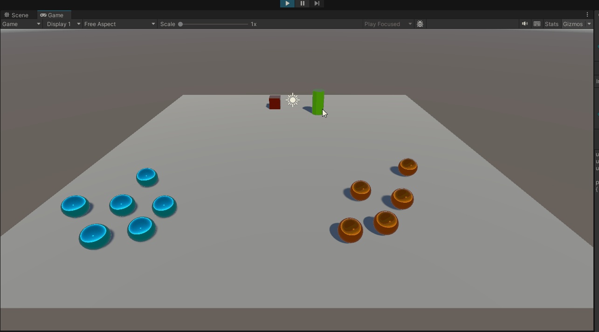

# Práctica 4 de Interfaces Inteligentes: Eventos en Unity
## Autor
* Nombre: Juan Rodríguez Suárez
* Correo: alu0101477596@ull.edu.es
## Descripción simulación desde el editor
### 1.-

Se ha implementado un detector de colisión en el cubo, de manera que cuando colisiona con el cilindro, el cubo emite un mensaje a todos los objetos que estén suscritos a él. En este caso, todas las esferas están suscritas al cubo y la función asociado a ellas consiste en aplicarle una fuerza en dirección a un *target* fijado en el inspector a velocidad constante.
### 2 y 3.-

Se han cambiado las esferas por arañas de diferente color cuyo collider es un rectángulo porque el mesh collider daba problemas. Se han añadido dos eventos 1 para cada araña de cada tipo, de manera que cuando el cubo colisiona con uno de los grupos se emite un mensaje y las arañas del otro grupo están suscritas a él.

Para los movimientos de las arañas se ha recurrido a *AddForce* dentro del *FixedUpdate*.
### 4.-

Se han cambiado los eventos para que las arañas de tipo 1 se teleporten directamente al objetivo y las de tipo 2 se orienten (roten) mirando a un huevo de tipo 1. Primero, para la definición del área del objeto de referencia, se ha usado un collider de tipo *trigger* para que el cubo pueda entrar y para que no pueda entrar a la esfera se ha empleado otro collider de un objeto vacío. Para la rotación de las arañas se ha usado *Quaternion.LookRotation* y luego un *Lerp* para suavizar el movimiento. Todo esto en el *FixedUpdate* y se controla cuando acaba la rotación con un *if* donde se comprueba si la diferencia entre la rotación actual y la anterior son iguales.
### 5.-

Se ha añadido un nuevo evento cuyos suscriptores son todos los huevos que invocan a una función para destruirse a sí mismos. La puntuación se suma en el cubo cuando detecta la colisión según el tipo de huevo.
### 6.-

Se ha añadido un Canvas con un texto en la esquina superior izquierda que muestra la puntuación actual. Se ha añadido un evento que se suscribe al cubo y se encarga de actualizar el texto del Canvas.
### 7.-

Se ha creado un nuevo Texto y simplemente se comprueba si la puntuación es mayor o igual a 100 y se muestra un mensaje en el nuevo Texto y se aumenta la velocidad del cubo.
### 8.-
El compañero Igor hizo un minijuego en el que tienes 100 de vida, las arañas te persiguen y si te dan pierdes 10 de vida cuyas mecánicas se tomarán en cuanta de cara al proyecto final.
### 9.-
El cubo siempre ha tenido un Rigidbody no cinemático y un Collider no trigger.